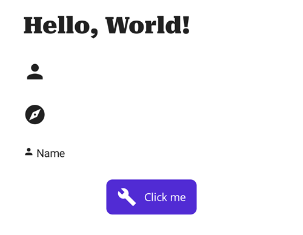

# Fonts og IconFonts med .NET MAUI



Fonte kan hentes fra:

[Google Fonts](https://fonts.google.com/)

[Google Icons](https://fonts.google.com/icons)

[Google Material Design Icons](https://github.com/google/material-design-icons)

[Material Design Icons](https://pictogrammers.com/library/mdi/)


Kopiér den nye font til `Resources | Fonts`. 

Registrér den nye font, her er valgt følgende:

- En Google Font: *RobotoSerif-Black.ttf* med alias "Roboto"
- En FontAwesome: *fa-solid-900.ttf* med alias "FA-solid"
- En Google Material Icon Font: *MaterialIcons-Regular* med alias "MaterialRegular"

```csharp
builder
	.UseMauiApp<App>()
	.ConfigureFonts(fonts =>
	{
		fonts.AddFont("OpenSans-Regular.ttf", "OpenSansRegular");
		fonts.AddFont("OpenSans-Semibold.ttf", "OpenSansSemibold");
		fonts.AddFont("RobotoSerif-Black.ttf", "Roboto");
		fonts.AddFont("fa-solid-900ttf", "FA-solid");
		fonts.AddFont("MaterialIcons-Regular.ttf", "MaterialRegular");
	});
```

&nbsp;

### En Label med Roboto font

Det eneste man skal gøre er at sætte FontFamily til den ønskede font:

```xml
<Label
    FontFamily="Roboto"
    FontSize="30"
    Text="Hello, World!" />
```
&nbsp;
### Icon Font
Udfordringen er at finde den korrekte kode for et ikon. Her benyttes værktøjet: [IconFont2Code](https://andreinitescu.github.io/IconFont2Code/).
I følgende eksempler benyttes *MaterialIcons-Regular.ttf* med et alias *MaterialRegular*, men fremgangsmåden er ens for andre Icon-fonte:

Når man åbner font-filen vha. værktøjet, kan man fremsøge icon med tilhørende UniCode. Her vælges ikonet for **Person**, som har Unicode koden: `\ue7fd`. 
Koden skal imidlertid escapes for at kunne benyttes af XAML og kommer til at hedde: `&#xe7fd;`, se [rfc5137 section 5.2. XML and HTML](https://datatracker.ietf.org/doc/html/rfc5137#section-5.2).

```xml
<Label
    FontFamily="MaterialRegular"
    FontSize="30"
    Text="&#xe7fd;" />
```
&nbsp;
### Icon Font som ResourceDictionary
Man bliver hurtigt træt af Unicode-koderne og heldigvis kan IconFont2Code generere et ResourceDictionary, som man direkte kan
sætte ind i f.eks. en ny fil kaldet *Icons.xam*l. Her er valgt 3 ikoner, hvilket giver følgende:

```xml
<?xml version="1.0" encoding="UTF-8" ?>
<?xaml-comp compile="true" ?>
<!--  Generated by IconFont2Code: https://andreinitescu.github.io/IconFont2Code'  -->
<ResourceDictionary 
    xmlns="http://schemas.microsoft.com/dotnet/2021/maui" 
    xmlns:x="http://schemas.microsoft.com/winfx/2009/xaml">
    <x:String x:Key="IconPerson">&#xe7fd;</x:String>
    <x:String x:Key="IconBuild">&#xe869;</x:String>
    <x:String x:Key="IconExplore">&#xe87a;</x:String>
</ResourceDictionary>
```

Filen sættes ind i folderen `Styles | Icons.xaml` og merges sammen med de andre ResourceDictionaries i `App.xaml`:

```xml
<?xml version = "1.0" encoding = "UTF-8" ?>
<Application xmlns="http://schemas.microsoft.com/dotnet/2021/maui"
             xmlns:x="http://schemas.microsoft.com/winfx/2009/xaml"
             xmlns:local="clr-namespace:Maui_IconFonts"
             x:Class="Maui_IconFonts.App">
    <Application.Resources>
        <ResourceDictionary>
            <ResourceDictionary.MergedDictionaries>
                <ResourceDictionary Source="Resources/Styles/Colors.xaml" />
                <ResourceDictionary Source="Resources/Styles/Styles.xaml" />
                <ResourceDictionary Source="Resources/Styles/Icons.xaml" />
            </ResourceDictionary.MergedDictionaries>
        </ResourceDictionary>
    </Application.Resources>
</Application
```

Nu kan man fremsøge de tre ikoner med `StaticResource` - og der er endda Intellisence! Hvor nemt er det ikke lige?

```xml
<Label
    FontFamily="MaterialRegular"
    FontSize="30"
    Text="{StaticResource IconExplore}" />
```
&nbsp;
### Icons og tekst
Ofte ønsker man at kombinere et ikon med en tekst. Her ses hvordan:

```xml
<Label>
    <Label.FormattedText> 
        <FormattedString>
            <Span 
                FontFamily="MaterialRegular"
                Text="{StaticResource IconPerson}" />
            <Span Text=" " />
            <Span Text="Name" />
        </FormattedString> 
    </Label.FormattedText>
</Label>
```
&nbsp;
### Icons og Buttons
Her ses hvordan man benytter et ikon på en Button:

```xml
<Button
    x:Name="CounterBtn"
    Clicked="OnCounterClicked"
    HorizontalOptions="Center"
    Text="Click me">
    <Button.ImageSource>
        <FontImageSource
            FontFamily="MaterialRegular"
            Glyph="{StaticResource IconBuild}"
            Size="25" />
    </Button.ImageSource>
</Button>
```
